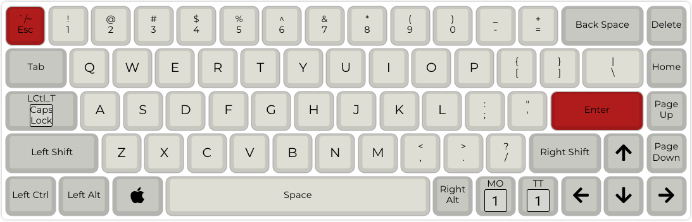
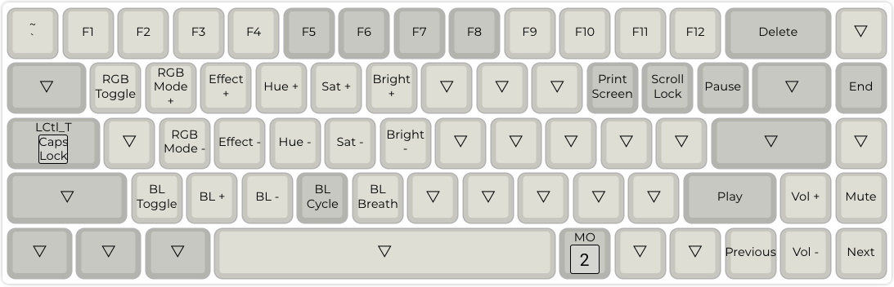
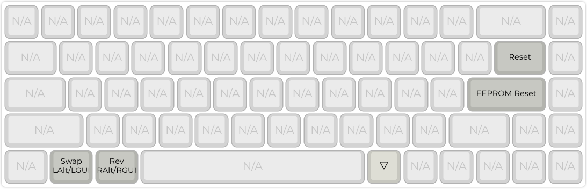

# dztech dz65 rgb mechanical keyboard


Original firmware can be found on [official site](https://kbdfans.com/products/dz68rgb-hot-swap-rgb-pcb).

Default QMK config can be obtain [here](https://config.qmk.fm/#/dztech/dz65rgb/v3/LAYOUT_65_ansi).

If you need add VIA support than you must build it on your own machine. How-to begin - https://docs.qmk.fm/#/newbs

Into created keymap add `rules.mk` with two options:

```
VIA_ENABLE = yes
LTO_ENABLE = yes
```

More info about VIA can be found [here](https://www.caniusevia.com/docs/configuring_qmk/).

## Current layers

### Layer 1



### Layer 2



### Layer 3



## Modding

DZ65 have output pins than can be used to underglow(qmk call it backlight). More info can be found here 
https://halogenica.net/hardware/adding-underglow-to-dz65rgb-and-qmk/
