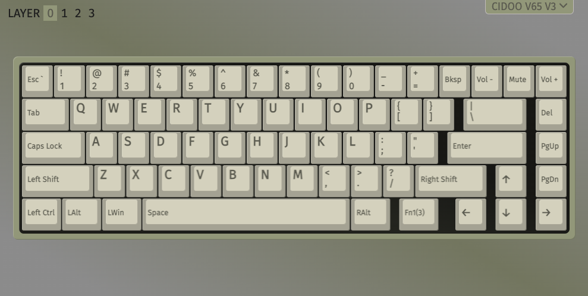
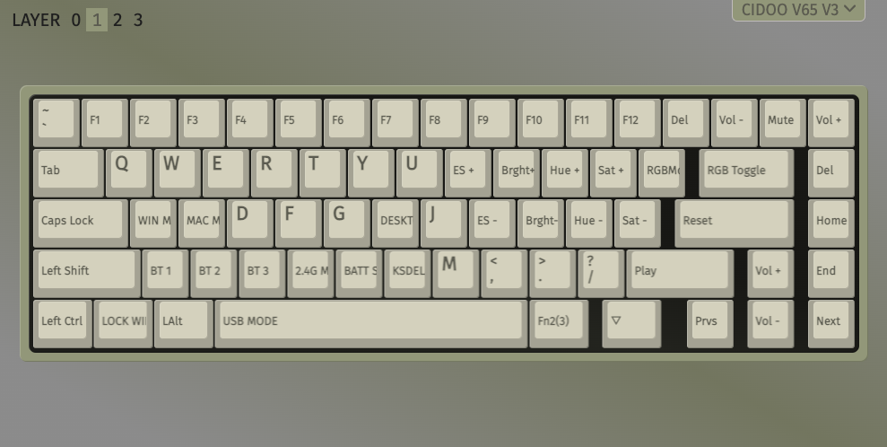

# epomaker cidoo v65 mechanical keyboard

Official keyboard page https://epomaker.com/products/cidoo-v65

Manual recommends use VIA from [this repository](https://github.com/WestBerryVIA/via-releases/releases):
- Settings: enable design tab
- Design
  - enable "use V2 definitions(deprecated)"
  - load definition
  - go to Configure
- Not working? Reopen app and repeat.

`KC_GESC` sends wrong combination for <kbd>CMD</kbd>+<kbd>Esc</kbd>: it send <kbd>CMD</kbd>+<kbd>Esc</kbd> instead of <kbd>CMD</kbd>+<kbd>`</kbd>.

It has problems with loading the saved configuration. If the keyboard is reset, it must be reconfigured.

## Current layers

### Layer 1

### Layer 2

