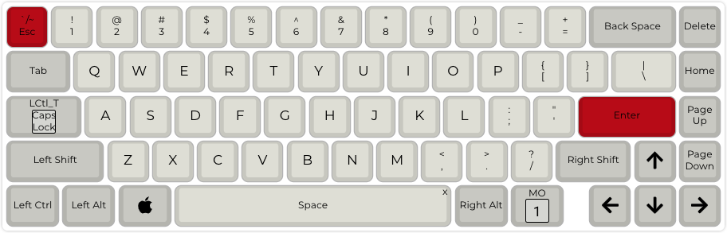

# kbdfand D65 mechanical keyboard


Original firmware can be found on [official site](https://kbdfans.com/products/icd65-mechanical-keyboard-kit).

Default QMK config can be obtain [here](https://config.qmk.fm/#/kbdfans/kbd67/mkiirgb/v3/LAYOUT_65_ansi_blocker).

If you need add VIA support than you must build it on your own machine. How-to begin - https://docs.qmk.fm/#/newbs

Into created keymap add `rules.mk` with two options:

```
VIA_ENABLE = yes
LTO_ENABLE = yes
```

More info about VIA can be found [here](https://www.caniusevia.com/docs/configuring_qmk/).

## Current layouts

### Layer 1



### Layout 2


